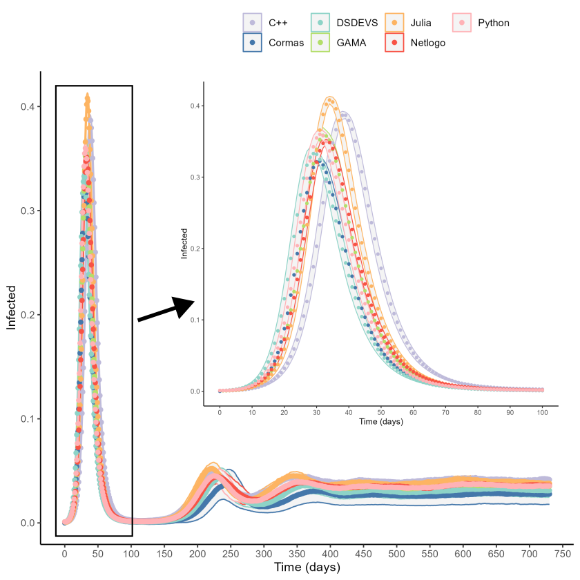

# Reproducibility Study of SEIR Epidemiological Models

This repository contains the simulation results and analysisc code for a reproducibility study examining implementations of a standard SEIR (Susceptible-Exposed-Infected-Recovered) epidemiological model across multiple agent-based modeling (ABM) platforms and programming languages.

## Abstract

Reproducibility is not only a cornerstone of the advancement of science, but also of scientific credibility. However, it remains a persistent challenge across many disciplines, and is now referred to as the "reproducibility crisis." This issue is particularly relevant in computational modeling, where different tools and implementation choices can lead to divergent outcomes.

In this study, we investigate the reproducibility of a standard and basic epidemiological model (SEIR) implemented via agent-based modeling (ABM) across seven different platforms and programming languages, including C++, Julia, Python, NetLogo, GAMA, Cormas, and PythonPDEVS. Each implementation was based on a common formal specification using the Overview, Design concepts and Details (ODD) protocol and developed independently by different modelers.

Our results show that while all implementations qualitatively reproduce the expected dynamics of the model—a sharp infection peak followed by damped oscillations—they produce statistically significant differences in key metrics such as peak amplitude and timing. These discrepancies appear to result from possibly both platform-specific behaviors and differences in modeler interpretation and implementations.

We conclude that even when a model is formally specified, ABM implementations can yield divergent numerical results, raising concerns about their reliability for quantitative analysis. Our findings highlight the need for rigorous reproducibility practices.

## Repository Structure

```
.
├── Graphs/                      # figures (EPS and PNG formats)
├── img/                         # Images in the paper
├── Sim-Results/                 # Simulation results in CSV by implementation
│   ├── EDO-GAMA/               # Ordinary Differential Equations in GAMA
│   ├── EDO-Julia/              # ODE implementation in Julia
│   ├── EDO-Python/             # ODE implementation in Python
│   ├── EDO-QSS-PowerDEVS/      # QSS solver in PowerDEVS
│   ├── SMA-C++/                # Agent-Based Model in C++
│   ├── SMA-Cormas/             # ABM in Cormas (Smalltalk)
│   ├── SMA-DSDEVS/             # ABM using PythonPDEVS
│   ├── SMA-GAMA/               # ABM in GAMA
│   ├── SMA-Julia/              # ABM in Julia
│   ├── SMA-netlogo/            # ABM in NetLogo
│   ├── SMA-netlogo-h/          # Alternative NetLogo implementation
│   └── SMA-Python/             # ABM in Python
├── R-MarkdownAnalysis.Rmd      # R Markdown analysis script
└── README.md                    # This file
```

## Implementations

This study compares 12 different implementations across two modeling paradigms:

### Agent-Based Models (SMA/ABM)
- **C++**: Native implementation for performance
- **Cormas**: Smalltalk-based ABM platform
- **PythonPDEVS**: Discrete Event System Specification approach
- **GAMA**: GIS Agent-based Modeling Architecture
- **Julia**: High-performance scientific computing language
- **NetLogo**: Two variants (standard and alternative)
- **Python**: Standard scientific Python stack

### Ordinary Differential Equations (EDO/ODE)
- **GAMA**: ODE solver in GAMA platform
- **Julia**: Using DifferentialEquations.jl
- **Python**: Using SciPy/NumPy
- **PowerDEVS**: Quantized State System (QSS) solver

All implementations were developed based on a common ODD (Overview, Design concepts and Details) protocol specification.

## Key Findings

The analysis reveals:

1. **Qualitative Agreement**: All implementations reproduce the expected SEIR dynamics with characteristic infection peaks followed by damped oscillations

2. **Quantitative Divergence**: Statistically significant differences in:
   - Peak infection amplitude
   - Timing of peak infection
   - Oscillation patterns

3. **Platform Effects**: Variations appear to stem from:
   - Platform-specific numerical behaviors
   - Differences in modeler interpretation
   - Implementation-specific design choices

## Visualizations

The repository includes comprehensive comparative analyses:

- **Infection Dynamics**: Time series plots showing infected population over time
- **Peak Analysis**: Boxplots comparing maximum infection peaks across implementations
- **Timing Analysis**: Boxplots showing when peaks occur
- **Clustering Analysis**: Dendrograms using both DTW (Dynamic Time Warping) and Euclidean distance metrics
- **Hierarchical Clustering**: Multi-level comparison of implementation similarities




## Analysis Tools

The statistical analysis is performed using R Markdown (`R-MarkdownAnalysis.Rmd`) and includes:

- Time series comparison
- Statistical significance testing
- Distance-based clustering (DTW and Euclidean)
- Hierarchical clustering analysis
- Visualization generation


